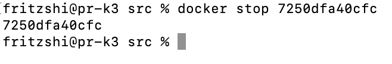
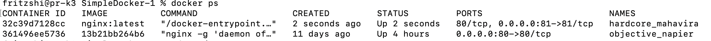
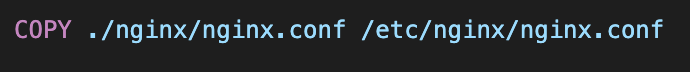

## Part 1. Готовый докер
Взять официальный докер образ с nginx и выкачать его при помощи docker pull

Проверить наличие докер образа через docker images

Запустить докер образ через docker run -d [image_id|repository]

Проверить, что образ запустился через docker ps

Посмотреть информацию о контейнере через docker inspect [container_id|container_name]

По выводу команды определить и поместить в отчёт размер контейнера, список замапленных портов и ip контейнера

id

size

ports

Остановить докер образ через docker stop [container_id|container_name]

Проверить, что образ остановился через docker ps

Запустить докер с портами 80 и 443 в контейнере, замапленными на такие же порты на локальной машине, через команду run

Проверить, что в браузере по адресу localhost:80 доступна стартовая страница nginx

Перезапустить докер контейнер через docker restart [container_id|container_name]

Проверить любым способом, что контейнер запустился

## Part 2. Операции с контейнером

Прочитать конфигурационный файл nginx.conf внутри докер контейнера через команду exec

Создать на локальной машине файл nginx.conf

Настроить в нем по пути /status отдачу страницы статуса сервера nginx

Скопировать созданный файл nginx.conf внутрь докер образа через команду docker cp

Перезапустить nginx внутри докер образа через команду exec

Проверить, что по адресу localhost:80/status отдается страничка со статусом сервера nginx

Экспортировать контейнер в файл container.tar через команду export

Остановить контейнер
(переделала все с контенером 7250dfa40cfc)

Удалить образ через docker rmi [image_id|repository], не удаляя перед этим контейнеры

Удалить остановленный контейнер

Импортировать контейнер обратно через команду import

Запустить импортированный контейнер

Проверить, что по адресу localhost:80/status отдается страничка со статусом сервера nginx

## Part 3. Мини веб-сервер

Написать мини сервер на C и FastCgi, который будет возвращать простейшую страничку с надписью Hello World!

скопировала сервер в докер через команду docker cp

перешла в интерактивный режим(внутрь своего контейнера)

скачала нужные библиотки:
apt update

apt-get install libfcgi-dev

apt-get install spawn-fcgi

apt-get install gcc

запуск

Запустить написанный мини сервер через spawn-fcgi на порту 8080

Написать свой nginx.conf, который будет проксировать все запросы с 81 порта на 127.0.0.1:8080

cкачала nginx

запустила nginx

скопировала туда файлы server.c и nginx.conf

запутила server.c

запустила через spawn-fcgi

перезапустила

Проверить, что в браузере по localhost:81 отдается написанная вами страничка

## Part 4. Свой докер

При написании докер образа избегайте множественных вызовов команд RUN

Написать свой докер образ, который:

1) собирает исходники мини сервера на FastCgi из Части 3

2) запускает его на 8080 порту

3) копирует внутрь образа написанный ./nginx/nginx.conf

4) запускает nginx.
nginx можно установить внутрь докера самостоятельно, а можно воспользоваться готовым образом с nginx'ом, как базовым.

Собрать написанный докер образ через docker build при этом указав имя и тег

Проверить через docker images, что все собралось корректно

Запустить собранный докер образ с маппингом 81 порта на 80 на локальной машине и маппингом папки ./nginx внутрь контейнера по адресу, где лежат конфигурационные файлы nginx'а (см. Часть 2)

Проверить, что по localhost:80 доступна страничка написанного мини сервера

Дописать в ./nginx/nginx.conf проксирование странички /status, по которой надо отдавать статус сервера nginx

Перезапустить докер образ
Если всё сделано верно, то, после сохранения файла и перезапуска контейнера, конфигурационный файл внутри докер образа должен обновиться самостоятельно без лишних действий

Проверить, что теперь по localhost:80/status отдается страничка со статусом nginx

## Part 5. Dockle

После написания образа никогда не будет лишним проверить его на безопасность.
== Задание ==

Просканировать образ из предыдущего задания через dockle [image_id|repository]

Исправить образ так, чтобы при проверке через dockle не было ошибок и предупреждений

Для исправления ошибки:

"CIS-DI-0005: Enable Content trust for Docker" перед тем как собрать докер, использую эту команду "export DOCKER_CONTENT_TRUST=1"

"CIS-DI-0010: Do not store credential in environment variables/files"-команда dockle -ak NGINX_GPGKEY -ak NGINX_GPGKEY_PATH lll:2.0

готовый dockerfile

## Part 6. Базовый Docker Compose

Вот вы и закончили вашу разминку. А хотя погодите...
Почему бы не поэкспериментировать с развёртыванием проекта, состоящего сразу из нескольких докер образов?
== Задание ==

Написать файл docker-compose.yml, с помощью которого:

1) Поднять докер контейнер из Части 5 (он должен работать в локальной сети, т.е. не нужно использовать инструкцию EXPOSE и мапить порты на локальную машину)

2) Поднять докер контейнер с nginx, который будет проксировать все запросы с 8080 порта на 81 порт первого контейнера

Замапить 8080 порт второго контейнера на 80 порт локальной машины

Остановить все запущенные контейнеры

Собрать и запустить проект с помощью команд docker-compose build и docker-compose up

Проверить, что в браузере по localhost:80 отдается написанная вами страничка, как и ранее

